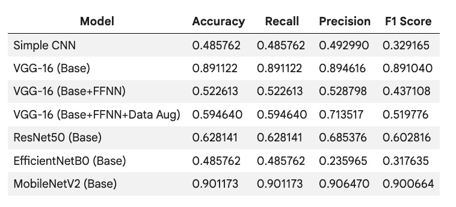

# 🚀 MonReader
MonReader: Document digitisation experience for the blind to predict if a given sequence of images contains an action of flipping.

## Background:
Our company develops innovative Artificial Intelligence and Computer Vision solutions that revolutionize industries. Machines that can see: We pack our solutions in small yet intelligent devices that can be easily integrated to your existing data flow. Computer vision for everyone: Our devices can recognize faces, estimate age and gender, classify clothing types and colors, identify everyday objects and detect motion. Technical consultancy: We help you identify use cases of artificial intelligence and computer vision in your industry. Artificial intelligence is the technology of today, not the future.

MonReader is a new mobile document digitization experience for the blind, for researchers and for everyone else in need for fully automatic, highly fast and high-quality document scanning in bulk. It is composed of a mobile app and all the user needs to do is flip pages and everything is handled by MonReader: it detects page flips from low-resolution camera preview and takes a high-resolution picture of the document, recognizing its corners and crops it accordingly, and it dewarps the cropped document to obtain a bird's eye view, sharpens the contrast between the text and the background and finally recognizes the text with formatting kept intact, being further corrected by MonReader's ML powered redactor.

## 🔄 Data Description
Page flipping videos were collected from smartphones and labeled as 'flipping' or 'not flipping'. These videos were clipped into short segments, and frames were extracted and saved sequentially with the naming structure: VideoID_FrameNumber. The dataset is organized into training and test directories, each containing flip and notflip subdirectories.

Example Data Structure:

/content/drive/MyDrive/MonReaderData/images
  training/
    flip/
      image_001.jpg
    notflip/
      image_003.jpg
  test/
    flip/
      image_test_001.jpg
    notflip/
      image_test_002.jpg
Images are 200x200 pixels, converted to grayscale (1 channel) for most models, and pixel values are normalized to the [0, 1] range.

## 📊 Dataset Statistics:
Training images: 2392 (1162 'flip', 1230 'notflip')
Test images: 597 The dataset is relatively balanced.

## 🛠️ Technologies Used
- tensorflow, keras: For building and training deep learning models.
- numpy: Numerical operations.
- pandas: Data manipulation and performance metric dataframes.
- matplotlib, seaborn: Data visualization, including training history plots and confusion matrices.
- scikit-learn: Performance metrics (accuracy, recall, precision, F1-score, confusion matrix).
- cv2: OpenCV for image processing (used for displaying images).
**Models Developed**
Seven different models were explored, ranging from a simple CNN to transfer learning approaches using pre-trained VGG16, ResNet50, EfficientNetB0, and MobileNetV2. All transfer learning models used their base as a frozen feature extractor with a custom classification head.

## 1️⃣ Simple Convolutional Neural Network (CNN)
Architecture: Sequential model with 3 Conv2D layers, followed by MaxPooling, Flatten, and two Dense layers (4 neurons, then 1 neuron with sigmoid activation).
Performance: Achieved very low accuracy (around 51%) on both training and validation sets, indicating it performed no better than random chance. The model failed to learn meaningful patterns.

## 2️⃣ VGG-16 (Base)
Approach: Utilized a frozen VGG16 base model (pre-trained on ImageNet) as a feature extractor, followed by a Flatten layer and a single Dense layer with sigmoid activation.
Performance: Demonstrated strong performance, achieving approximately 89-90% accuracy, recall, precision, and F1 Score on the test set. This model generalized very well to unseen data, highlighting the effectiveness of transfer learning.

## 3️⃣ VGG-16 (Base + FFNN)
Approach: Similar to Model 2, but with a more complex classification head consisting of a Flatten layer and a Feed Forward Neural Network (Dense(128, relu), Dropout(0.3), Dense(64, relu)) before the final Dense(1, sigmoid) output layer.
Performance: Performed poorly (around 52% accuracy) on the test set. The additional complexity of the FFNN without data augmentation led to severe overfitting and poor generalization.

## 4️⃣ VGG-16 (Base + FFNN + Data Augmentation)
Approach: Identical architecture to Model 3 but incorporated data augmentation during training (rotation, width/height shifts, shear, zoom, horizontal flip).
Performance: Showed improved performance over Model 3 (around 59% accuracy on test set) but still significantly less than Model 2. While data augmentation helped mitigate overfitting, the complex FFNN head still struggled to achieve high performance compared to Model 2's simpler head.

## 5️⃣ ResNet50 (Base)
Approach: Employed a frozen ResNet50 base model (pre-trained on ImageNet) as a feature extractor, followed by a Flatten layer and a single Dense layer with sigmoid activation.
Performance: Achieved moderate performance (around 62-68% accuracy) on both training and test sets. It showed minimal overfitting but was significantly less effective than Model 2 and Model 7.

## EfficientNetB0 (Base)
Approach: Used a frozen EfficientNetB0 base model (pre-trained on ImageNet) as a feature extractor, followed by a Flatten layer and a single Dense layer with sigmoid activation.
Performance: Performed very poorly (around 48% accuracy), essentially no better than random chance. This model, in its current configuration, was ineffective for the task.

## MobileNetV2 (Base)
Approach: Utilized a frozen MobileNetV2 base model (pre-trained on ImageNet) as a feature extractor, followed by a Flatten layer and a single Dense layer with sigmoid activation.
Performance: Achieved high performance (around 90% accuracy, recall, precision, and F1 Score) on the test set, comparable to Model 2. Its lightweight architecture makes it suitable for mobile deployment scenarios.

## Model Performance Comparison (Test Set)

 

Model	Accuracy	Recall	Precision	F1 Score
Simple CNN	0.485762	0.485762	0.492990	0.329165
VGG-16 (Base)	0.891122	0.891122	0.894616	0.891040
VGG-16 (Base+FFNN)	0.522613	0.522613	0.528798	0.437108
VGG-16 (Base+FFNN+Data Aug)	0.594640	0.594640	0.713517	0.519776
ResNet50 (Base)	0.628141	0.628141	0.685376	0.602816
EfficientNetB0 (Base)	0.485762	0.485762	0.235965	0.317635
MobileNetV2 (Base)	0.901173	0.901173	0.906470	0.900664

## Actionable Insights & Recommendations
**Key Insights:**
1. Transfer Learning's Superiority: Model 1 (Simple CNN) performed poorly (around 51% accuracy), reinforcing that pre-trained models are crucial for image classification, especially with limited domain-specific data.
2. VGG-16 Base is a Strong Performer: Model 2 (VGG-16 Base) achieved high performance (approximately 89-90% accuracy, recall, precision, and F1 Score) on the test set. This indicates that VGG16 as a frozen feature extractor with a simple classification head is highly effective.
3. Complexity Can Hurt Without Augmentation: Model 3 (VGG-16 Base + FFNN) performed poorly (around 52% accuracy), highlighting that adding complex layers without adequate data diversity or regularization leads to severe overfitting.
Data Augmentation's Critical Role: Model 4 (VGG-16 Base + FFNN + Data Augmentation) showed improved performance over Model 3 (~59% accuracy in comparison dataframe). This underscores data augmentation's potential to mitigate overfitting and improve generalization when using more complex classification heads.
4. ResNet50 (Model 5) Underperformed: Model 5, using a frozen ResNet50 base with a simple head, showed suboptimal performance (around 62-68% accuracy). While slightly better than random chance, it was significantly worse than Model 2 and Model 7.
5. EfficientNetB0 (Model 6) Also Underperformed: Model 6, based on a frozen EfficientNetB0 base, performed poorly (around 48% accuracy), essentially random chance. Its current implementation is not effective.
6. MobileNetV2 (Model 7) is another Strong Performer: Model 7, using a frozen MobileNetV2 base with a simple classification head, also achieved high performance (around 90% accuracy, recall, precision, and F1 Score) on the test set, making it comparable to Model 2.

## Recommendations:
1. Prioritize Model 2 or Model 7 for Deployment: Given their consistently high performance (89-90% accuracy) and relatively simple architectures (frozen base + single dense layer), Model 2 (VGG-16) and Model 7 (MobileNetV2) are the strongest and most reliable candidates for deployment. MobileNetV2 might be preferred for mobile applications due to its typically smaller size and faster inference speed.
2. Advanced Tuning for ResNet50 and EfficientNetB0: For Models 5 (ResNet50) and 6 (EfficientNetB0), consider more advanced transfer learning techniques:
3. Fine-tuning: Unfreeze a few top layers of the base model and train them along with the new classification head. This allows the pre-trained weights to adapt to the specific dataset.
4. More Complex Heads: Experiment with different numbers of dense layers, dropout rates, and activation functions in the classification head.
5. Learning Rate Schedules: Use learning rate schedules or callbacks to better optimize training for deeper models.
Robustness Testing for Deployment: Regardless of the chosen model, conduct extensive robustness testing with diverse real-world images that the MonReader application might encounter. This includes variations in lighting, background clutter, paper types, and page orientations.
6. Performance Monitoring in Production: Implement continuous monitoring of the deployed model's performance. Track key metrics (accuracy, false positives/negatives) to detect performance degradation over time and inform retraining needs.
