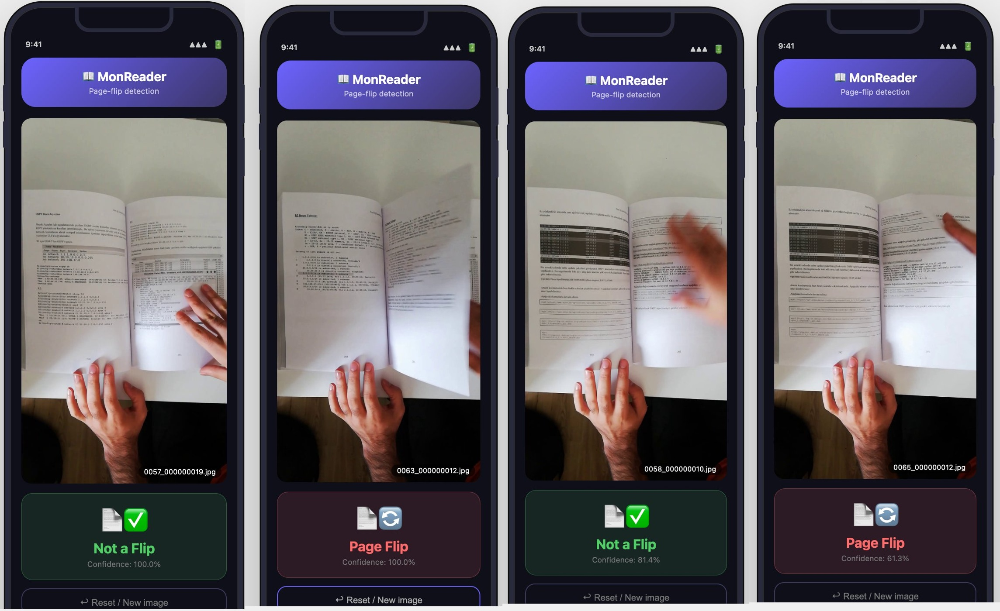
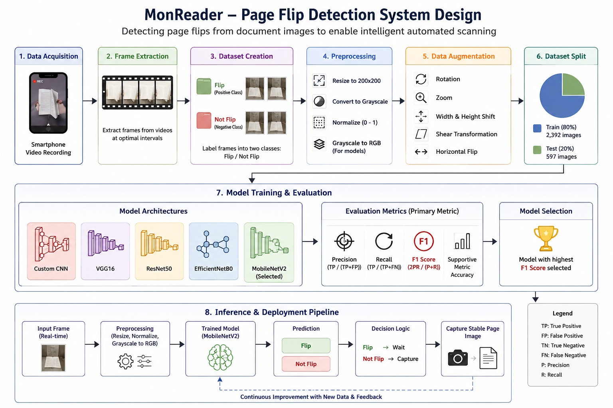

# 📖 MonReader: Page Flip Detection using Deep Learning

<div align="center">


### Detecting page flips from document images to power intelligent mobile document digitization

</div>

---

# 🚀 Project Overview

This project was completed as part of an applied Machine Learning engagement at **Apziva**.

The objective was to develop a **computer vision model capable of detecting whether a document page is currently being flipped or not using a single image frame**.

The project contributes to **MonReader**, an AI-powered document digitization platform designed to automate scanning and document capture for users including:

- Blind and visually impaired users
- Researchers digitizing large document volumes
- Organizations requiring automated document ingestion

The page flip detector acts as an intelligent trigger mechanism that determines the optimal moment to capture document images automatically.

<center> </center>

- Monreader project deployed at: https://huggingface.co/spaces/dcsamuel/monreaderview

- Restart spaces, Make sure backend at https://huggingface.co/spaces/dcsamuel/monreader is running to view


---

# 🎈 Business Problem

Traditional document scanning workflows require manual intervention:

❌ User positions page  
❌ User presses capture  
❌ User adjusts perspective  
❌ User repeats for hundreds of pages  

MonReader aims to automate this process.

The challenge:

> Build an image classification system that determines whether a page is actively being flipped so the application knows exactly when to capture the next document frame.

---

# 👁️ Project Objective

Develop and compare multiple Deep Learning approaches capable of:

- Detecting page flip events
- Achieving high classification performance
- Generalizing to unseen images
- Supporting future deployment in mobile environments

Success was evaluated using:

- Accuracy
- Precision
- Recall
- F1 Score
- Generalization capability

---

# 📊 Dataset

The dataset consisted of smartphone-recorded page flipping videos.

Videos were processed into image frames and labeled into two classes:

| Class | Meaning |
|--------|---------|
| Flip | Page is actively being turned |
| Not Flip | Page remains stable |

### Dataset Statistics

| Dataset | Samples |
|----------|---------|
| Training Images | 2,392 |
| Testing Images | 597 |
| Image Size | 200 × 200 |
| Classes | 2 |

Distribution:

- Flip → 1,162
- Not Flip → 1,230

Dataset was relatively balanced.

---

# ⚙️ Project Workflow

```text
Raw Videos
    ↓
Frame Extraction
    ↓
Labeling (Flip / Not Flip)
    ↓
Image Preprocessing
    ↓
Data Augmentation
    ↓
Model Development
    ↓
Training & Validation
    ↓
Performance Evaluation
    ↓
Model Selection
    ↓
Model Deployment
```

---

# 🧠 Methodology

<center> </center>

## 1. Data Preparation

### Image Processing
- Converted images to grayscale
- Resized to 200×200
- Normalized pixel values to [0–1]

### Data Augmentation

Applied augmentation to improve robustness:

- Rotation
- Width shifting
- Height shifting
- Zoom
- Shear transformation
- Horizontal flipping

---

## 2. Exploratory Data Analysis

Key observations:

✅ Dataset showed minimal class imbalance  
✅ Images retained sufficient visual patterns after grayscale conversion  
✅ Augmentation improved generalization potential  

---

# Models Evaluated

Multiple architectures were explored to determine the best trade-off between performance and efficiency.

---

## Model 1 — Custom CNN

Architecture:
- Conv2D
- MaxPooling
- Flatten
- Dense layers

### Result

| Metric | Score |
|---------|-------|
| Accuracy | ~51% |

### Observation

Performance remained close to random guessing.

Conclusion:

Custom CNN architecture was insufficient for learning complex page motion patterns.

---

## Model 2 — VGG16 (Transfer Learning)

Architecture:
- Frozen VGG16 feature extractor
- Classification head

### Result

| Metric | Score |
|---------|-------|
| Accuracy | ~89–90% |

### Observation

Transfer learning significantly improved feature extraction.

---

## Model 3–6

Additional experiments included:

- VGG16 + Feedforward layers
- VGG16 + Data Augmentation
- ResNet50
- EfficientNetB0
- MobileNetV2

Results showed varying degrees of overfitting and underperformance.

---

# Model Evaluation Strategy

For this project, model selection was based primarily on **F1 Score rather than accuracy**.

Why?

In page flip detection, both error types matter:

- **False Positive** → Capturing while the page is still turning
- **False Negative** → Missing the correct capture moment

Accuracy alone may appear strong while producing undesirable behavior in production.

F1 Score was therefore selected because it balances:

\[
F1 = \frac{2 \times Precision \times Recall}{Precision + Recall}
\]

Where:

- **Precision** → How often predicted flips were actually flips
- **Recall** → How many real flips were successfully detected
- **F1 Score** → Overall balance between the two

---

# Model Comparison

| Model                       | Accuracy | Recall   | Precision | F1 Score | Size (MBs) |
|-----------------------------|----------|----------|-----------|----------|------------|
| Simple CNN                  | 0.485762 | 0.485762 | 0.492990  | 0.329165 | 1.57       |
| VGG-16 (Base)               | 0.891122 | 0.891122 | 0.894616  | 0.891040 | 56.13      |
| VGG-16 (Base+FFNN)          | 0.522613 | 0.522613 | 0.528798  | 0.437108 | 65.16      |
| VGG-16 (Base+FFNN+Data Aug) | 0.594640 | 0.594640 | 0.713517  | 0.519776 | 65.16      |
| ResNet50 (Base)             | 0.628141 | 0.628141 | 0.685376  | 0.602816 | 90.36      |
| EfficientNetB0 (Base)       | 0.919598 | 0.919598 | 0.924697  | 0.91949 | 30.27      |
| 🏆MobileNetV2 (Base)          | 0.896147 | 0.896147 | 0.903742  | 0.895879 | 8.85     |


---


# 🏆 Final Selected Model — MobileNetV2

The final solution achieved an **F1 Score of 93.6%**, indicating strong and balanced performance for automated page capture workflows.

Architecture:
- MobileNetV2 (pretrained)
- Frozen convolutional backbone
- Custom classification layer

Special preprocessing:

- Grayscale → RGB conversion layer

### Final Performance

| Metric | Training | Test |
|---------|----------|------|
| Accuracy | 93.1% | **93.6%** |
| Recall | 93.1% | **93.6%** |
| Precision | 93.3% | **93.7%** |
| F1 Score | 93.1% | **93.6%** |

---

# Why MobileNetV2 Won

MobileNetV2 demonstrated:

✅ Strong generalization  
✅ Lightweight architecture  
✅ Excellent classification performance  
✅ Mobile deployment readiness  

This makes it particularly aligned with MonReader’s product requirements.

---
# Deployment
## Backend Deployment Setup (Flask API): 
Files for a Flask API backend were created in the backend_files directory:
- app.py: A Flask application to serve page-flip predictions using the TFLite model, handling image uploads and returning JSON responses.
- requirements.txt: Lists Python dependencies for the Flask app, including tensorflow-cpu and opencv-python-headless.
- Dockerfile: Defines the Docker image for the backend, setting up the environment, installing dependencies, copying the model and app.py, and configuring Gunicorn to run the Flask app.
- README.md: Provides metadata and description for the Hugging Face Space.
## Frontend Deployment Setup (Streamlit App): 
Files for a Streamlit frontend application were created in the frontend_files directory:
- app.py: A Streamlit application using st.components.v1.html to embed a custom HTML/CSS/JavaScript UI, allowing users to upload images and interact with the deployed backend API.
- requirements.txt: Lists Python dependencies for the Streamlit app, including streamlit and requests.
- Dockerfile: Defines the Docker image for the frontend, setting up the environment, installing dependencies, copying app.py, and configuring Streamlit to run the app.
- README.md: Provides metadata and description for the Hugging Face Space.
## Hugging Face Deployment: 
Both the backend and frontend applications were deployed to separate Hugging Face Spaces ([dcsamuel/monreader](https://huggingface.co/spaces/dcsamuel/monreader) and ([dcsamuel/monreaderview](https://huggingface.co/spaces/dcsamuel/monreaderview) respectively). The huggingface_hub library was used to log in, create repositories, and upload the necessary files. For the backend, api.upload_folder with delete_patterns='*' was used to ensure a fresh upload, while for the frontend, individual files were uploaded using api.upload_file.

# Tech Stack

| Category | Tools |
|----------|-------|
| Language | Python |
| Deep Learning | TensorFlow, Keras |
| Data Processing | NumPy, Pandas |
| Visualization | Matplotlib, Seaborn |
| Computer Vision | OpenCV |
| Evaluation | Scikit-Learn |

---

# 🔌 Repository Structure

```bash
.
├── notebooks/
│   └── Monreader.ipynb
├── images/
│   ├── train/
│   └── test/
├── models/
├── outputs/
└── README.md
```

---

# How to Run

## Clone Repository

```bash
git clone https://github.com/samuelmugisha/cJ3rTwQftyT1LoOx.git
cd cJ3rTwQftyT1LoOx
```

## Install Dependencies

```bash
pip install tensorflow keras numpy pandas matplotlib seaborn opencv-python scikit-learn
```

## Launch Notebook

```bash
jupyter notebook
```

Open:

```text
notebooks/Monreader.ipynb
```

---

# Key Learnings

This project reinforced several important ML engineering principles:

- Transfer learning can outperform custom CNNs on limited datasets
- Data augmentation improves generalization
- Lightweight architectures are valuable for production deployment
- Evaluation metrics should extend beyond accuracy

---

# My Contribution

As the contributor to this project, I:

- Designed and executed the end-to-end experimentation workflow
- Built multiple deep learning pipelines
- Implemented preprocessing and augmentation strategies
- Evaluated model performance across architectures
- Identified MobileNetV2 as the optimal deployment candidate
- Translated technical outcomes into business recommendations

---

# 🎈 Conclusion

This project demonstrates practical capability across:

✔ Deep Learning  
✔ Computer Vision  
✔ Transfer Learning  
✔ Model Evaluation  
✔ Experimental Design  
✔ Production-Oriented AI Thinking  

The final MobileNetV2 solution achieved **93.6% F1 Score**, showing strong readiness for real-world document digitization workflows.

For recruiters and hiring managers:

This work reflects the ability to move beyond model training into **problem framing, experimentation, architecture comparison, and business-oriented decision making**—the exact skills required for applied AI and ML engineering roles.

---

## Author

**Samuel Mugisha D.C**

AI • Machine Learning • Applied Data Science

GitHub:  
https://github.com/samuelmugisha
